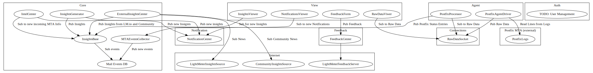

# Draft for an architecture. WIP, as always.

Lightmeter ControlCenter is still in very a early development stage.

Below you can find a draft of a component view of what the software will be.

It's worth noticing that it's not a real component view, as the interface between components is not yet
defined and it's not possible to represent the the dependencies across components or how they communicate.

The plans are to have na event based architecture, with messages being passed accross components using some middleware,
instead of them talking directly to each other.

We have not yet decided what approach for messaging to use. For the sake of simplicity, we need to go for a a brokerless
approach.

Stay tuned!
