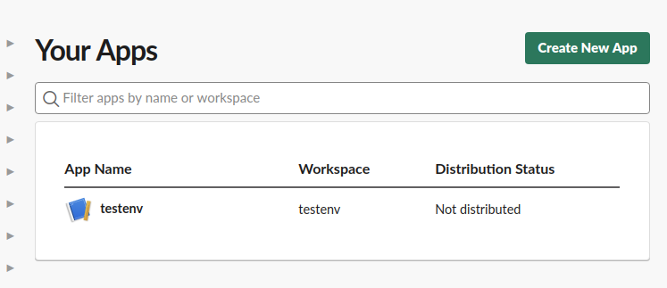

<!--
SPDX-FileCopyrightText: 2021 Lightmeter <hello@lightmeter.io>
SPDX-License-Identifier: AGPL-3.0-only
-->

# Lightmeter ControlCenter

[](https://gitlab.com/lightmeter/controlcenter/-/commits/master)
[](https://translate.lightmeter.io/engage/controlcenter/)
<br/>
[](https://goreportcard.com/report/gitlab.com/lightmeter/controlcenter)
[](https://sonarcloud.io/dashboard?id=lightmeter_controlcenter)
[](https://gitlab.com/lightmeter/controlcenter/-/commits/master)
[](https://sonarcloud.io/dashboard?id=lightmeter_controlcenter)
<br/>
[](https://sonarcloud.io/dashboard?id=lightmeter_controlcenter)
[](https://sonarcloud.io/dashboard?id=lightmeter_controlcenter)
[](https://sonarcloud.io/dashboard?id=lightmeter_controlcenter)
[](https://sonarcloud.io/dashboard?id=lightmeter_controlcenter)
[](https://sonarcloud.io/dashboard?id=lightmeter_controlcenter)
[](https://sonarcloud.io/dashboard?id=lightmeter_controlcenter)
[](https://sonarcloud.io/dashboard?id=lightmeter_controlcenter)
[](https://sonarcloud.io/dashboard?id=lightmeter_controlcenter)
<br/>
[](https://t.me/joinchat/BYUM5BOaC-CkYgQXhfFY4Q)
[](https://phplist.lightmeter.io/lists/?p=subscribe&id=1)

## Contents

- [Introduction](#introduction)
- [Supported Mail Transfer Agents](#supported-mail-transfer-agents)
- [Quickstart](#quickstart)
- [Install](#install)
    - [Install from binaries](#install-from-binaries)
    - [Docker image](#docker-image)
    - [NixOS Package and Module](#nixos-package-and-module)
- [Upgrade](#upgrade)
- [Usage](#usage)
    - [Rotated files](#rotated-files)
    - [Imported logs](#imported-logs)
    - [API](#api)
    - [Headless mode](#headless-mode-no-web-ui)
    - [Authentication](#authentication)
- [Feature documentation](#feature-documentation)
    - [Notifications](#notifications)
    - [Domain mapping](#domain-mapping)
    - [Message detective](#message-detective)
    - [Peer network powered features](#peer-network-powered-features)
        - [Brute force protection](#brute-force-protection)
- [Known issues](#known-issues)
- [Development](#development)
    - [Frontend development with VueJs](#frontend-development-with-vuejs)
    - [Browser automation tests](#browser-automation-tests)
    - [Making user interfaces translatable (i18n)](#making-user-interfaces-translatable-i18n)
- [Troubleshooting](#troubleshooting)
- [Supported by](#supported-by)
- [License and Copyright information](#license-and-copyright-information)

## Introduction

Welcome to Lightmeter Control Center, the Open Source mailops monitoring application.


## Supported Mail Transfer Agents

Currently Postfix MTA is supported. Future support for additional MTAs is planned.

## Quickstart

1. Install Lightmeter Control Center as you prefer:
   1. [Download Docker Image](https://hub.docker.com/r/lightmeter/controlcenter)
   2. [Download source code from Gitlab](https://gitlab.com/lightmeter/controlcenter/-/releases)
   3. [Download from Gitlab package registry](https://gitlab.com/lightmeter/controlcenter/-/packages)
2. When using the binaries you can run Lightmeter using `./lightmeter -workspace ~/lightmeter_workspace -watch_dir /var/log`
   This command will start the application monitoring `/var/log` in real time (including old logs found there), and store operation files in `lightmeter_workspace` folder in your user's home directory.
3. If you are using the docker image, please look at the [Usage](#usage), Docker image section in the README.md
4. Open `http://localhost:8080/` to see the web interface
5. Secure web access to the Web UI as necessary (see [Known issues](#known-issues))
6. If necessary, change the date range to see charts for the period of the logs you just imported

## Installation

### Install using Docker

Docker images are generated for each release and are published in the Lightmeter [registry on Gitlab](https://gitlab.com/lightmeter/controlcenter/container_registry) and in the [Docker Hub](https://hub.docker.com/r/lightmeter/controlcenter).

You can use the `latest` tag if desired. For usage see [Docker image](#docker-image).

Additionally we publish every night (in UTC time) two docker images with the tags `nightly-master` and `nightly-develop`. `nightly-develop` consists on a build from the `develop` branch, containing the latest changes, very unstable and suitable for use in production. `nightly-master` is more stable, containing changes that will be included in the next release, but isn't recommended to be used in production either.

### Build from source code

The following dependencies are needed during development:

- Bash
- [Git](https://git-scm.com) on any recent (as in 2020) version.
- [Go compiler](https://golang.org/) version 1.15 or newer.
- [GCC](https://gcc.gnu.org/) version 9.3 or newer.
- Libc development files. Both [glibc](https://www.gnu.org/software/libc/) and [musl](https://www.musl-libc.org/) have been successfully tested.
- [GNU Make](https://www.gnu.org/software/make/manual/make.html) or compatible.
- [Ragel](https://www.colm.net/open-source/ragel/) version 6.X. We have successfully tested version 6.10. Ragel 7 is currently NOT supported.
- [vue cli](https://cli.vuejs.org/) - Used for the web based UI.

For instance, on Alpine Linux 3.12, they can be installed with:

```
$ apk add git make gcc go libc-dev ragel npm
$ npm install -g @vue/cli@v4.5.9 @vue/cli-service-global@4.5.9
```

To build a release version, dynamically linked to the local libc, execute:
```
make release

```

And to create a static linked (supported only if your libc can be statically linked) version, execute:
```
make static_release
```

That will download all the dependencies and build a file called `lightmeter`,
which you can simply copy to your Postfix server and use it as described in the `Usage` section.

If you are planning to contribute with code (Thank you! :-)), please check [Development](#development).

## Upgrade

Limited Automatic data migration during upgrade is supported. As the data format is not yet stable, we cannot guarantee 100% data safety.

We advice you to create a backup of the workspace directory before a major upgrade.
A backup can be performed by stopping controlcenter, copying the workspace directory somewhere else (or creating an archive, etc.),
upgrade controlcenter, and finally start it again.

Achieving this is easy using manual upgrade based on replacing binary files.
For Docker-based installations you should configure a workspace directory outside of the Lightmeter Docker container.
See 'Usage' on how to specify which workspace directory Lightmeter should use.

We have planned support for [on-the-fly backup](https://gitlab.com/lightmeter/controlcenter/-/issues/170) for future releases,
where this procedure will become easier, safer and more flexible.

## Install

### Install from binaries

We provide pre-build architecture dependent binaries on [Gitlab](https://gitlab.com/lightmeter/controlcenter/-/releases) that
should run on any modern Linux distribution. Just download them, set them as executable and executed as described in [Usage](##Usage).

Your operating system should provide certificate authority certificates (ca-certificates package in many distributions) by default,
but in case you are keeping your own CA certificates, you'll need to set the environment variable `SSL_CERT_DIR` to it.

For instance, on Alpine linux, you can use, before executing the binary:

```sh
export SSL_CERT_DIR=/usr/share/ca-certificates/mozilla
```

But this is almost always not needed as Control Center is able to properly find them.

For more information about how the CA certificates are found, please check the correspondent [Go source code](https://golang.org/src/crypto/x509/root_unix.go).

#### Rsync managed logs

In case the logs directory passed via `-watch_dir` is not in the same filesystem as postfix writes them, but instead copied via rsync,
you must pass the command line argument `-logs_use_rsync`, otherwise new log lines received after the first `rsync` execution won't be noticed.

When using rsync, remembed **NOT** to use any in-place synchronization option, such as `--append`, as Control Center expects the default rsync behaviour
on updating files that consists on first create a temporary file in the destination and onde it's completely transfered, rename it to the final file.

### Docker image

The simplest way to use the latest version with docker is with the command:

```
$ docker run -p 8080:8080 -v "<path_to_workspace>:/workspace:rw" -v "/var/log/:/logs:ro" \
  registry.gitlab.com/lightmeter/controlcenter -workspace /workspace -watch_dir /logs

```

Where `<path_to_workspace>` is a directory where Control Center will keep data that has to be persisted accross restarts.

Then open your browser on http://localhost:8080 to access the web based user interface.

You can find all released images in the [registry page](https://gitlab.com/lightmeter/controlcenter/container_registry).

### NixOS Package and Module

You can find the released  pkg, module, testbed and an instruction for "How to build & install it?" on [Github](https://github.com/ngi-nix/lightmeter).

### API

Lightmeter ships with a simple REST API designed for user interfaces. It is used by the Web UI.

Swagger-based API documentation and experimentation pages are generated automatically on development builds. Access them via `http://lightmeter-address:8080/api`, eg. [http://localhost:8080/api](http://localhost:8080/api).

### Headless mode (no Web UI)

Headless mode is allows ControlCenter to run the backend only, without the Web UI. This is currently intended for development purposes. Headless modes will be useful for using only the API part of the application.

Running headless mode requires building ControlCenter for this purpose:

```
make devheadless # Build ControlCenter
./lightmeter -stdin -log-level DEBUG --listen :8003 # Example command to start ControlCenter quickly (same as running a normal build)
```

### Authentication

- Single user, password-based authentication is currently supported by default. Multiple user accounts via self-registration, without approval, can be enabled by changing the value of `AllowMultipleUsers` in `auth/auth.go` and recompiling.

#### Password reset

You can reset the administrator password using the command line:

`./lightmeter -email_reset '<registration-email>' -password '<new-password>'`

#### Delete users

- Delete all users by deleting `<workspace-name>/auth.db*`. E.g.: `rm -rf /var/lib/lightmeter_workspace/auth.db*`.
- Delete a single user manually using sqlite using `sqlite3 <workspace-name>/auth.db 'delete from users where email = "<admin email address>"'`. E.g.: `sqlite3 /var/lib/lightmeter_workspace/auth.db 'delete from users where email = "admin@email-address.com"'`.

## Usage

For detailed information, check [Usage](cli_usage.md).

- Run `lightmeter -help` to show a list of all available commands
- Following compilation (or download) of Lightmeter Control Center you should run the binary `lightmeter` to read logs and launch a local webserver, which allows viewing Lightmeter Control Center via a Web UI in a browser on the same network on port 8080, eg. [http://localhost:8080/](http://localhost:8080/). You can use `-listen ":9999"` for instance to use a different port or network interface, in this case all interfaces on port 9999.
- The web UI authenticated sessions last 1 week by default
- To supply logs via stdin instead of logfile location, use the command line argument `-stdin` like `lightmeter -stdin < [log-data]`.
- You can also receive logs listening on an unix socket or a TCP port, as in `-socket "unix;/path/to/socket.sock"` or
`-socket "tcp;localhost:9999"`. It's important to notice that such socket communication is unanthenticated and unencrypted, so use it only in safe environments!
- To supply single logs file, use the command line argument `-stdin` like `tail -f /path-to-file.log | lightmeter -stdin`.
- Mailserver data is stored in separate workspaces so that different servers can be monitored separately. The workspace directory is set as `/var/lib/lightmeter_workspace` by default and can be changed with `-workspace /path/to/workspace`.
- As Postfix logs don't contain a year as part of the date of each line, when using `-stdin`, the year for processed logs is assumed to be the current one. To override this and specify a year manually, use the `-log_starting_year` flag like `-log_starting_year 2018`
- Lightmeter can also "watch" a directory with postfix logs managed by logrotate, importing existing files
(even if compressed with gzip or bzip2) and waiting new log files that happen after such import.
To use it, start lightmeter with the argument `-watch_dir /path/to/dir`, which is likely to be `/var/log/mail`.
Lightmeter won't import such logs again if they have already been imported, in case of a process restart.

### Reverse proxy and securing the user interface

Control Center has a web based user interface, provided over a ***plain*** HTTP server. It does not ship a HTTP server.
It's up to you to deploy it behind a HTTP reverse proxy, such as NGINX, Apache HTTPD, H2 or Traefik.

Running behind a reverse proxy does not require any extra configuration, even if Control Center user interface is available
in a path different from `/`, for instance, on `https://example.com/lightmeter/`.

Control Center assumes that it's running behind a reverse proxy to obtain the user's IP (used for rate limiting requests and prevent some sorts of DOS attacks).

In case you are running Control Center in a private network and do not need to run it behind a reverse proxy, using plain HTTP, you should pass
an extra argument in the command line `-i_know_what_am_doing_not_using_a_reverse_proxy` or set the environment variable
`LIGHTMETER_I_KNOW_WHAT_I_AM_DOING_NOT_USING_A_REVERSE_PROXY=true`.

###

Currently the following patterns for log files are "watched":
- mail.log
- mail.warn
- mail.err
- maillog
- zimbra.log

You can override this by passing the patterns on the command-line as in `-log_file_patterns mail.log:mail.warn:maillog` or via the environment variable `LIGHTMETER_LOG_FILE_PATTERNS=mail.log:mail.warn:maillog`.

### Environment variables

For cloud installations of Lightmeter, it may be necessary to set parameters via environment variables, rather than command-line parameters (which cannot always be used).

Here are all parameters you can set through environment variables, and their respective command-line equivalents:
- `LIGHTMETER_WORKSPACE=/path/to/workspace` (`-workspace`)
- `LIGHTMETER_WATCH_DIR=/var/log` (`-watch_dir`)
- `LIGHTMETER_LOG_LEVEL=DEBUG` (`-log-level DEBUG`)
- `LIGHTMETER_LISTEN=localhost:9999` (`-listen`)
- `LIGHTMETER_LOGS_SOCKET=unix;/path/to/socket.sock` (`-logs_socket`)
- `LIGHTMETER_LOGS_USE_RSYNC=true` (`-logs_use_rsync`)
- `LIGHTMETER_LOGS_STARTING_YEAR=2019` (`-log_starting_year`)
- `LIGHTMETER_LOG_FORMAT=prepend-rfc3339` (`-log_format`)
- `LIGHTMETER_LOG_FILE_PATTERNS=mail.log:mail.err:mail.warn:zimbra.log:maillog` (`-log_file_patterns`)
- `LIGHTMETER_I_KNOW_WHAT_I_AM_DOING_NOT_USING_A_REVERSE_PROXY=true` (`-i_know_what_am_doing_not_using_a_reverse_proxy`)

### Rotated files

We are able to recognize files archived by `logrotate` and import them in the first time the application runs.
Currently only files compressed with gzip (`.gz`), bzip2 (`.bz2`) and uncompressed files are supported.

The suffixes on the archived log files that are supported are:

- mail.log.2.gz and similar, where the suffix number gets higher as files get older.
- mail.log-20030102.gz where the suffix number is a date, where the lower the value, the older the file is.

It's important to notice that, in case a directory contains archived files with different naming conventions,
only the ones using the latter naming convention (the ones suffixed with a date) will be used by Control Center.
All other archived files will be ignored.

Please create an issue on [Gitlab](https://gitlab.com/lightmeter/controlcenter/-/issues/) if you use a different log naming convention.

## Syslog compatibility

If you are using `-watch_dir` or the `LIGHTMETER_WATCH_DIR` environment variable to read the logs, we at the moment support only the following syslog file format:

| rsyslog.conf                     | command line option                                  | environment variable                                  |
| -------------------------------- | ---------------------------------------------------- | ----------------------------------------------------- |
| `RSYSLOG_TraditionalFileFormat`  | `-log_format default` or not pass this option at all | `LIGHTMETER_LOG_FORMAT=default` or not defined at all |
| `RSYSLOG_SyslogProtocol23Format` | `-log_format rfc3339`                                | `LIGHTMETER_LOG_FORMAT=rfc3339`                       |

If you use a different format, please let us know via a Gitlab issue.

### Importing logs

The importing process will take a long time, depending on how many files you have and how big they are.

It's important not to use `-watch_dir` with other ways of obtaining logs, and future versions of Lightmeter will disable such behaviour.

In case you are having an error similar to:

```
2020/05/29 13:45:05 Missing file mail.log . Instead, found:  /var/log/mail/mail.log.2.gz

```

This means you should have a file `mail.log`, which means you should check your Postfix installation and ensure it's emitting logs properly.

### Reading from Logstash

**NOTE**: this is a very experimental feature, not well tested or supported. It can eat your logs!

Control Center can read logs via a network or unix domain sockets, and this can be used to receive logs from Logstash.

It's important to notice that this support does not support any authentication or security, so be sure to use it in a secure network or provide your own
security layer (VPN, SSH tunnel, etc.).

First, start Control Center with the option `-socket tcp=:9999`, to listen in the TCP port 9999, or `-socket unix=/path/to/socket.sock`.

#### Using the default JSON encoded logs

Since version 1.8 we support the default JSON encoded logs sent via Logstash, meaning you won't need to change your Logstash configuration.

You'll need to add the command line option `-log_format logstash`, or set the environment variable `LIGHTMETER_LOG_FORMAT=logstash`.

Then configure logstash as following:

```
filter {
  if [log][file][path] == "/var/log/mail.log" {
      clone {
        add_field => { "log-type" => "mail" }
        clones => ["lightmeter"]
      }
  }
}

output {
  if [log-type] == "mail" and [type] == "lightmeter"{
        tcp {
            host => "address-of-control-center-host"
            port => 9999
        }
    }
}
```

#### Using a custom log format

Alternatively, add the command line option `-log_format prepend-rfc3339` (or the environment variable `LIGHTMETER_LOG_FORMAT=prepend-rfc3339`),
meaning that it expects a time to come in the beginning of each log line.

Then configure Logstash to something similar to the following (Thank you Alexander Landmesser for the help :-)):

```
filter {
  if [log][file][path] == "/var/log/mail.log" {
      clone {
        add_field => { "log-type" => "mail" }
        clones => ["lightmeter"]
      }
  }
}

output {
  if [log-type] == "mail" and [type] == "lightmeter"{
        tcp {
            host => "address-of-control-center-host"
            port => 9999
            codec => line {
                format => "{[@timestamp]} %{[message]}"
            }
        }
    }
}

```

***IMPORTANT***: Control Center expects to receive **ALL** Postfix logs, so don't filter any log out using Logstash or ElasticSearch,
otherwise Control Center won't work properly.

Such mechanism is very powerful and we are just starting exploring it. In case your Postfix logs are wrapped in other formats (JSON, Protobuf, etc.),
you should be able to easily add support for it. Please have a look at the file `logeater/transform/prepend-rfc3339.go` for the implementation
of the `-log_format prepend-rfc3339` used above.

## Feature documentation

### Notifications

#### Integrate slack

Create a app on your slack account go to https://api.slack.com/

- Click on "Create Custom APP" after that you will see a popup for configuring your app (https://api.slack.com/apps).



- Choose a "Development Slack Workspace" and give your app a name.


- Click the "Permissions" card or in the sidebar click "OAuth & Permissions".
- Under "Scopes" click "Add an OAuth Scope".
- Add "chat:write" from the dropdown menu.
- Under "OAuth Tokens & Redirect URLs" click "Install to Workspace.
- On the following page click "Allow"
- Copy the newly generated OAuth token somewhere safe
- Invite the bot to your channel by typing into the desired channel: `/invite @bot-name` (replace the name, and use auto-complete for hints)

Add the token and channel details to lightmeter go to the settings page


Congrats you successfully configured the slack notifications

### Domain Mapping

Domain Mapping is supported. This means remote hosts which are related to each other are treated as one where necessary (eg outlook.com and hotmail.com).

Currently the mapping is hardcoded in the application - changing the mappings requires [rebuilding](#Build-from-source-code) the application.

Mappings are stored in `domainmapping/mapping.json` and cover the largest remote hosts by default. The mappings can be easily customised by editing that file, followed by [rebuilding](#Build-from-source-code).

Please consider extending the default mappings by making merge requests to benefit all users!

### Message Detective

#### Admin view

You can access the admin view for the message detective clicking the "Search" icon on the navigation bar. 
Using sender address, recepient address and the time interval you want to check, you can identify the status of any message processed in the given timeframe. 

The search result will include the status of the message, the queue ID, the time the message was processed and the status code of each delivery attempt. 

A message can have one of the following states: 
- Sent for successfull delivery
- Bounced for messages refused by recipient's mail provider
- Deferred for messages temporarily refused and retried
- Expired for abandoned delivery after too many deferred attempts
- Returned for when a return notification was sent back to the original sender (only if your Postfix is configured to do this)


#### Public view

You can enable the message detective for any unauthenticated users in the Settings Page. 

Any user (whom you have provided the link to) can check the fate of a message independently, using the same search terms as the admin. They will also see the same amount of information in the search results as the admin. 

In addition, the user will also have the option to Escalate any Bounced and Expired results to the mail server admin.
Lightmeter will then generate an insight that shows all the details, including queue ID for the admin to investigate further. 
If you have notifications enabled, this will also trigger a notification. 

If you enable the message detective for your end-users, make sure to share the public page URL with them.
Rate limiting is applied on the number of searches, with a current maximum of 20 searches every 10 minutes.

### Peer network powered features

These features are powered by real-time information shared between Lightmeter users via a meta-network called the Peer Network, managed by the core Lightmeter team.

Currently the network requires participation to access these features; to receive signals a Lightmeter instance must also be sending them. This is the default behaviour.

#### Brute force protection

Protection against malicious SMTP and IMAP login attempts requires access to a Dovecot server. Dovecot occupies the role of a convenient authentication policy client for both Postfix (SMTP) and Dovecot itself (IMAP). 

When enabled, both Dovecot and Postfix will use a Lightmeter blocklist (generated from real-time Peer Network signals) for pre-authentication checks.

Protection is not complete or guaranteed, and could theoretically result in legitimate authentication attempts being blocked.

##### Dovecot configuration

To enable blocking of malicious IPs in Dovecot (IMAP/POP defence), execute the following script:

```
#!/bin/sh

# setup lightmeter auth_policy server on dovecot

# TODO: check the dovecot path is correct
cat << EOF > /etc/dovecot/conf.d/10-auth_lightmeter.conf

# Dovecot will query Lightmeter's blocklist for every incoming IMAP/POP3 connection
auth_policy_server_url = https://auth.intelligence.lightmeter.io/auth

# TODO: replace the following by a random string of your own
# See https://doc.dovecot.org/settings/core/#setting-auth-policy-hash-nonce for more information
auth_policy_hash_nonce = JHghjghHJGhjg$345gfGF35435

# The remote IP address, that is trying to authenticate, is the minimal bit of information
# needed by Lightmeter to block illegitimate authentication attempts
# See https://doc.dovecot.org/settings/core/#setting-auth-policy-request-attributes for more information
auth_policy_request_attributes = remote=%{rip}

# Check Lightmeter blocklist before auth (pre-auth), not after
# Also, report un·successful auth attempts
auth_policy_check_before_auth = yes
auth_policy_check_after_auth = no
auth_policy_report_after_auth = yes

# The following is needed to verify the number of blocked auth attempts
auth_verbose = yes
EOF

dovecot reload
```

###### Older Dovecot version

In case you're running a version of Dovecot older than 2.3.1, you will experience that the `auth_policy_check_before_auth` parameter does not exist.

If this is the case, leave out these three parameters from the above configuration file:
- `auth_policy_check_before_auth`
- `auth_policy_check_after_auth`
- `auth_policy_report_after_auth`

The counting of blocked IPs will be doubled in your Control Center¹, but you'll still enjoy protection (¹ we're trying to find a workaround).


##### Postfix configuration

To enable blocking of malicious IPs by Postfix (SMTP defence) do the following.

Use Dovecot SASL to pre-authorize connection attempts. Note: if Postfix is already configured to use SASL, this will replace it.

If Dovecot is not already being used as a SASL server, add this to your Dovecot config file (e.g. `/etc/dovecot/conf.d/10-auth.conf`):

```
unix_listener /var/spool/postfix/private/auth {
    group = postfix_group
    mode = 0666
    user = postfix_user
  }
```

Then make Postfix use the Dovecot SASL server by adding the following to your Postfix config file (e.g. `/etc/postfix/main.cf`, or alternatively by using `postconf` CLI utility):

```
smtpd_sasl_auth_enable=yes
smtpd_sasl_path=/var/spool/postfix/private/auth
smtpd_sasl_type=dovecot
```

More documentation can be found on postfix' website:
- [Configuring Dovecot SASL](http://www.postfix.org/SASL_README.html#server_dovecot)
- [Enabling SASL in Postfix](http://www.postfix.org/SASL_README.html#server_sasl_enable)


##### Blocklist use

In order for Control Center to know that your Postfix/Dovecot are using the blocklist, please fill in their IP address on the Settings Page ("*Postfix public IP*").

Currently the only supported setup for this is when Postfix and Dovecot are on the same IP address.


## Known issues

### High risk

- The Web UI loads without SSL (unencrypted) by default, so credentials are at risk if transmitted over public networks (planned fix: [#480](https://gitlab.com/lightmeter/controlcenter/-/issues/480))
- Memory consumption for very high volume mailservers is unknown (planned fix: [#238](https://gitlab.com/lightmeter/controlcenter/-/issues/238))

### Low risk

- Some Insights are triggered too frequently (depending on use case) and can fill the homepage with repetitious details (planned fix: [#231](https://gitlab.com/lightmeter/controlcenter/-/issues/231), [#157](157))
- Clicking on homepage chart sections can result in the reporting of misleading stats (planned fix: [#63](https://gitlab.com/lightmeter/controlcenter/-/issues/63))
- Old data is deleted automatically from the database when it's older than three months. Such value is currently hardcoded, and we should make it configurable by the users (planned fix: [#565](https://gitlab.com/lightmeter/controlcenter/-/issues/565)).

## Development

### Frontend development with VueJs

ControlCenter's Web UI uses the [VueJS](https://vuejs.org/) framework and related tooling. The frontend is effectively an independent Javascript application which interacts with the backend via the [API](#api). When built for production, ControlCenter's backend serves the frontend files for convenience.

The frontend files such as javascipt and css need to be compiled and moved to the correct directory before they can be used be a web browser. This process is handled automatically by the make commands / build scripts, and VueJS terminal tools for development.

The most efficient workflow for developing / making changes to the frontend files is to run the frontend separately to the backend (unlike in production mode), using [Vue CLI](https://cli.vuejs.org/) for serving and automatically rebuilding files in development mode. This allows you to see changes made to frontend files almost immediately without executing any commands or manually rebuilding or compiling any files.

#### Instructions

Open two terminal windows or tabs with the working directory set to ControlCenter's repository root.

1. In the first terminal build and run ControlCenter in [headless mode](#headless-mode-no-web-ui)
1. In the second terminal start the VueJS frontend development server (in development mode): `make serve_frontend_dev`
1. The terminal output in the 2nd terminal should tell you which local URL/port to access the development UI on

Any changes made to frontend files will be detected automatically, necessary files will be rebuilt, and changes should take effect immediately in your local browser. To apply changes made to backend files you will need to [rebuild](#build-from-source-code) the backend from source, as the frontend is now running separately and independently, without affecting backend / golang files.

### Browser automation tests

These tests (also referred to as User Acceptance Tests) are found in the `acceptance_tests` directory and executed by [Gauge](https://gauge.org/) and [Taiko](https://github.com/getgauge/taiko). These tests are part of CI/CD and executed on every GitLab commit.

Please refer to the specific documentation on how run them manually in the file [acceptance_tests/README.md](acceptance_tests/README.md).

### Making user interfaces translatable (i18n)

The following command will look for translatable words inside interface files (currently files within the `www` directory) and generate a `.po` file for the English language: `make code2po`

### Making backend strings translatable (i18n)

Translatable strings can be found in diverse files, such as Go code, used by the backend, or Vue/html/js files used in the web ui.

In order to update the translable strings, making them available for translators with the command:

```bash
$ make messages
```

Example:

```go
package content

import (
	"gitlab.com/lightmeter/controlcenter/i18n/translator"
)

type Block struct{}

func (d *Block) String(s string) string {
	return translator.I18n("%v percent bounce rate between %v and %v")
}
```

## Troubleshooting

### Issues after upgrade from version x to y

* Many problems with loading ui of controlcenter can be resolved by clearing browser cookies and cache

## Supported by

This project has received funding from the European Union’s Horizon 2020 research and innovation programme within the framework of the NGI-POINTER Project funded under grant agreement No 871528.


This project has received funding from the European Union’s Horizon 2020 research and innovation programme within the framework of the NGI-ZERO Project funded under grant agreement No 825310.


## License and Copyright information

This project is licensed under AGPL-3.0. However, some files are under different licenses, for accurate information, please check individual files and the file `.reuse/dep5`.

Copyright 2021, Lightmeter <hello@lightmeter.io>
