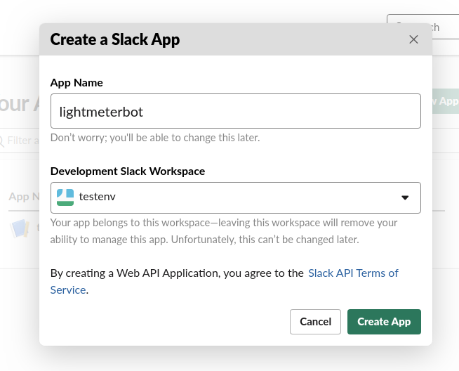
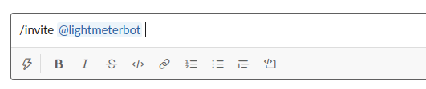
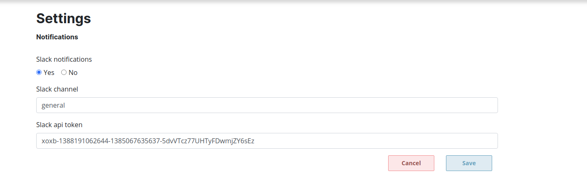

# Lightmeter ControlCenter (Alpha)

[](https://gitlab.com/lightmeter/controlcenter/-/commits/master)
[](http://translate.lightmeter.io/engage/controlcenter/?utm_source=widget)
<br/>
[](https://goreportcard.com/report/gitlab.com/lightmeter/controlcenter)
[](https://sonarcloud.io/dashboard?id=lightmeter_controlcenter)
[](https://gitlab.com/lightmeter/controlcenter/-/commits/master)
[](https://sonarcloud.io/dashboard?id=lightmeter_controlcenter)
<br/>
[](https://sonarcloud.io/dashboard?id=lightmeter_controlcenter)
[](https://sonarcloud.io/dashboard?id=lightmeter_controlcenter)
[](https://sonarcloud.io/dashboard?id=lightmeter_controlcenter)
[](https://sonarcloud.io/dashboard?id=lightmeter_controlcenter)
[](https://sonarcloud.io/dashboard?id=lightmeter_controlcenter)
[](https://sonarcloud.io/dashboard?id=lightmeter_controlcenter)
[](https://sonarcloud.io/dashboard?id=lightmeter_controlcenter)
[](https://sonarcloud.io/dashboard?id=lightmeter_controlcenter)

## Contents

- [Introduction](#introduction)
- [Quickstart](#quickstart)
- [Install](#install)
- [Upgrade](#upgrade)
- [Usage](#usage)
- [Feature details](#feature-details)
- [Known issues](#known-issues)
- [Development](#development)

## Introduction

Welcome to Lightmeter Control Center, the Open Source mailops monitoring application.


## Quickstart

1. Install Lightmeter Control Center as you prefer:
   1. [Download Docker Image](https://hub.docker.com/r/lightmeter/controlcenter)
   2. [Download source code from Gitlab](https://gitlab.com/lightmeter/controlcenter/-/releases)
   3. [Download from JFrog](https://bintray.com/lightmeter/controlcenter/controlcenter)
2. When using the binaries you can run Lightmeter using `./lightmeter -workspace ~/lightmeter_workspace -watch_dir /var/log`
   This command will start the application monitoring `/var/log` in real time (including old logs found there), and store operation files in `lightmeter_workspace` folder in your user's home directory.
3. If you are using the docker image, plese look at the [Usage](#usage), Docker image section in the README.md
4. Open `http://localhost:8080/` to see the web interface
5. If necessary, change the date range to see charts for the period of the logs you just imported

## Supported Mail Transfer Agents

Currently Postfix MTA is supported. Future support for additional MTAs is planned.

## Install

### Install using Docker

Docker images are generated for each release and are published in the Lightmeter [registry on Gitlab](https://gitlab.com/lightmeter/controlcenter/container_registry). You can use the `latest` tag if desired. For usage see [Docker image](#docker-image).

### Build from source code

The following dependencies are needed during development:

- Bash
- [Git](https://git-scm.com) on any recent (as in 2020) version.
- [Go compiler](https://golang.org/) version 1.15 or newer.
- [GCC](https://gcc.gnu.org/) version 9.3 or newer.
- Libc development files. Both [glibc](https://www.gnu.org/software/libc/) and [musl](https://www.musl-libc.org/) have been successfully tested.
- [GNU Make](https://www.gnu.org/software/make/manual/make.html) or compatible.
- [Ragel](https://www.colm.net/open-source/ragel/) version 6.X. We have successfully tested version 6.10 and don't guarantee it will work with the version 7 as we have not tested it.
- [vue cli](https://cli.vuejs.org/) - only for frontend version 2

For instance, on Alpine Linux 3.12, they can be installed with:

```
$ apk add git make gcc go libc-dev ragel
```

To build Lightmeter during development, execute:

```
make dev
```

And for the final release, execute:
```
make release

```

And to create a static linked (please use carefully) version, execute:
```
make static_release
```

That will download all the dependencies and build a file called `lightmeter`,
which you can simply copy to your Postfix server and use it as described in the `Usage` section.

### Cross compilation

To compile to Windows, using Linux as host (requires cross compiler):

```
make windows_release
```

Which will create a file called `lightmeter.exe`.

It's good to remember that we probably won't ever support Windows, but that does not mean you cannot use it there :)

## Upgrade

Automatic data migration during upgrade is not yet supported. Depending on how you upgrade, your data may be lost.

- Keep your account data (e.g. administrator accounts and preferences): do not delete `<workspace name>/auth.db*`
- Keep your mail performance data: do not delete `<workspace name>/logs.db*`

Achieving this is easy using manual upgrade based on replacing binary files. For Docker-based installations you should configure a workspace directory outside of the Lightmeter Docker container. See 'Usage' on how to specify which workspace directory Lightmeter should use.

## Usage

For detailed information, check [Usage](cli_usage.md).

- Run `lightmeter -help` to show a list of all available commands
- Following compilation (or download) of Lightmeter Control Center you should run the binary `lightmeter` to read logs and launch a local webserver, which allows viewing Lightmeter Control Center via a Web UI in a browser on the same network on port 8080, eg. [http://localhost:8080/](http://localhost:8080/). You can use `-listen ":9999"` for instance to use a different port or network interface, in this case all interfaces on port 9999.
- The web UI authenticated sessions last 1 week by default
- To supply logs via stdin instead of logfile location, use the command line argument `-stdin` like `lightmeter -stdin < [log-data]`.
- To supply single logs file, use the command line argument `-stdin` like `tail -f /path-to-file.log | lightmeter -stdin`.
- Mailserver data is stored in separate workspaces so that different servers can be monitored separately. The workspace directory is set as `/var/lib/lightmeter_workspace` by default and can be changed with `-workspace /path/to/workspace`.
- As Postfix logs don't contain a year as part of the date of each line, when using `-stdin`, the year for processed logs is assumed to be the current one. To override this and specify a year manually, use the `-log_starting_year` flag like `-log_starting_year 2018`
- Lightmeter can also "watch" a directory with postfix logs managed by logrotate, importing existing files
(even if compressed with gzip) and waiting new log files that happen after such import.
To use it, start lightmeter with the argument `-watch_dir /path/to/dir`, which is likely to be `/var/log/mail`.
Lightmeter won't import such logs again if they have already been imported, in case of a process restart.

Currently the following patterns for log files are "watched":
  - mail.log
  - mail.warn
  - mail.err

### Rotated files

We are able to recognize files archived by `logrotate` and import them in the first time the application runs.
Currently only `gzip`ped and uncompressed files are supported.

The suffixes on the archived log files that are supported are:

- mail.log.2.gz and similar, where the suffix number gets higher as files get older.
- mail.log-20030102.gz where the suffix number is a date, where the lower the value, the older the file is.

Please create an issue on [Gitlab](https://gitlab.com/lightmeter/controlcenter/-/issues/) if you use a different log naming convention.

### Importing logs

The importing process will take a long time, depending on how many files you have and how big they are.

It's important not to use `-watch_dir` with other ways of obtaining logs, and future versions of Lightmeter will disable such behaviour.

In case you are having an error similar to:

```
2020/05/29 13:45:05 Missing file mail.log . Instead, found:  /var/log/mail/mail.log.2.gz

```

This means you should have a file `mail.log`, which means you should check your Postfix installation and ensure it's emitting logs properly.

### Docker image

The simplest way to use the latest version with docker is with the command:

```
$ docker run -p 8080:8080 -v "<path_to_workspace>:/workspace:rw" -v "/var/log/:/logs:ro" \
  registry.gitlab.com/lightmeter/controlcenter -workspace /workspace -watch_dir /logs

```

Where `<path_to_workspace>` is a directory where Control Center will keep data that has to be persisted accross restarts. 

Then open your browser on http://localhost:8080 to access the web based user interface.

You can find all released images in the [registry page](https://gitlab.com/lightmeter/controlcenter/container_registry).

### NixOS Package and Module

You can find the released  pkg, module, testbed and an instruction for "How to build & install it?" on [Github](https://github.com/ngi-nix/lightmeter).

### API

Lightmeter ships with a simple REST API designed for user interfaces. It is used by the Web UI. 

Swagger-based API documentation and experimentation pages are generated automatically on development builds. Access them via `http://lightmeter-address:8080/api`, eg. [http://localhost:8080/api](http://localhost:8080/api).

### Authentication

- Single user, password-based authentication is currently supported by default. Multiple user accounts via self-registration, without approval, can be enabled by changing the value of `AllowMultipleUsers` in `auth/auth.go` and recompiling.

#### Password reset

You can reset the user password using the command line:

`./lightmeter -email_reset '<registration-email>' -password '<new-password>'`

#### Delete users

- Delete all users by deleting `<workspace-name>/auth.db*`. E.g.: `rm -rf /var/lib/lightmeter_workspace/auth.db*`.
- Delete a single user manually using sqlite using `sqlite3 <workspace-name>/auth.db 'delete from users where email = "<admin email address>"'`. E.g.: `sqlite3 /var/lib/lightmeter_workspace/auth.db 'delete from users where email = "admin@email-address.com"'`.

## Feature details

### Domain Mapping

Domain Mapping is supported. This means remote hosts which are related to each other are treated as one where necessary (eg outlook.com and hotmail.com).

Currently the mapping is hardcoded in the application - changing the mappings requires [rebuilding](#Build-from-source-code) the application.

Mappings are stored in `domainmapping/mapping.json` and cover the largest remote hosts by default. The mappings can be easily customised by editing that file, followed by [rebuilding](#Build-from-source-code).

Please consider extending the default mappings by making merge requests to benefit all users!

## Known issues

### High risk

- The SQLite databases will grow linearly in size forever as no disk-reclaiming policy exists (planned fix: [#77](https://gitlab.com/lightmeter/controlcenter/-/issues/77))
- Memory consumption for very high volume mailservers is unknown (planned fix: [#238](https://gitlab.com/lightmeter/controlcenter/-/issues/238))

### Low risk

- Some Insights are triggered too frequently (depending on use case) and can fill the homepage with repetitious details (planned fix: [#231](https://gitlab.com/lightmeter/controlcenter/-/issues/231), [#157](157))
- Some messages are recorded twice during statistical processing, resulting in double counting for e.g. sent status (planned fix: [#82](https://gitlab.com/lightmeter/controlcenter/-/issues/82))
- Clicking on homepage chart sections can result in the reporting of misleading stats (planned fix: [#63](https://gitlab.com/lightmeter/controlcenter/-/issues/63))

## Development

### Browser automation tests

These tests (also referred to as User Acceptance Tests) are found in the `acceptance_tests` directory and executed by [Gauge](https://gauge.org/) and [Taiko](https://github.com/getgauge/taiko). These tests are part of CI/CD and executed on every GitLab commit.

### Run tests locally

```bash
make dev
cd acceptance_tests
ln -sf ../www
# if you have chrome / chromium installed already, then disable duplicate chromium download...
# export TAIKO_SKIP_CHROMIUM_DOWNLOAD=1
# ... and set the path to your existing chrome / chromium binary
# export TAIKO_BROWSER_PATH=/usr/bin/chrome-gnome-shell
# get node dependencies including gauge and taiko
npm install
# set the path to necessary npm binaries
export PATH=$PATH:$PWD/node_modules/.bin
# execute tests (all tests, for convenience)
npm test
# execute gauge directly (for access to all gauge options)
npm run-script gauge run specs/
```

After doing all this you should see a Chrome / Chromium browser open, and tests start to run.

### Making user interfaces translatable (i18n)

The following command will look for translatable words inside interface files (currently files within the `www` directory) and generate a `.po` file for the English language: `make code2po`

## Notifications 

### Integrate slack 

Create a app on your slack account go to https://api.slack.com/

Click on "Create New APP" after that you will see a popup for configuring your app (https://api.slack.com/apps).


Choose a "Development Slack Workspace" and give your app a name.



Create a oauth token for your app (https://api.slack.com/apps/{{REPLACE_ME}}/oauth).

 

Add "write to channel" permission to your previously created token (https://api.slack.com/apps/{{REPLACE_ME}}/oauth).


Invite the bot into your channel



Add the token and channel details to lightmeter go to the settings page



Congrats you successfully configured the slack notifications

### Making backend strings translatable (i18n)

The following command will look for translatable strings inside of all go files. All translatable strings needs to be wrap with
the the function `translator.I18n`

Generates a `.po` file for all supported languages: 

```bash
make go2po
```

Example:

```go
package content

import (
	"gitlab.com/lightmeter/controlcenter/i18n/translator"
)

type Block struct{}

func (d *Block) String(s string) string {
	return translator.I18n("%%v percent bounce rate between %%v and %%v")
}
```
